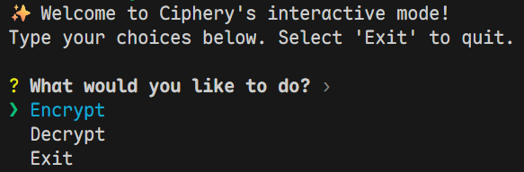
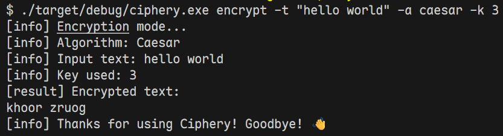

# Ciphery 🔐

[English](README.md) | [中文](README_zh.md)

一个基于 Rust 开发的轻量级交互式命令行加密/解密工具。

**Ciphery** 是一个基于 Rust 开发的轻量级、交互式命令行文本加密/解密工具。它既支持像传统 CLI 工具一样通过单行命令快速执行加解密，也提供了一个用户友好的交互式 REPL 菜单模式。

## ✨ 特性 (Features)

- **交互式模式 (Interactive Mode)**：直接运行 `ciphery` 即可进入带有上下键选择的交互式菜单，无需记忆复杂的命令行参数。
- **单行命令模式 (CLI Mode)**：支持通过子命令（`encrypt` / `decrypt`）快速执行任务，适合脚本自动化。
- **多数据源支持**：支持直接在终端输入文本，也支持通过文件路径读取长文本进行加解密。
- **多算法支持**：
  - ✅ 凯撒密码 (Caesar Cipher)
  - 🚧 ROT13 (Coming soon)
  - 🚧 Base64 (Coming soon)

## 🚀 安装 (Installation)

目前你可以通过源码直接编译安装。请确保你的电脑上已经安装了 [Rust 环境 (Cargo)](https://www.rust-lang.org/tools/install)。

```bash
# 1. 克隆仓库
git clone https://github.com/SmlCoke/ciphery.git
cd ciphery

# 2. 编译并安装到本地 Cargo bin 目录
cargo install --path .
```
*安装完成后，你可以在终端的任何地方直接使用 `ciphery` 命令。*

## 💡 使用方法 (Usage)

### 1. 交互式模式 (推荐)
直接在终端输入 `ciphery`，根据屏幕提示进行选择和输入即可：
```bash
ciphery
```

### 2. 命令行模式
如果你明确知道需要的参数，可以直接使用子命令：

**加密文本：**
```bash
# 使用凯撒密码（偏移量为3）加密字符串 "hello"
ciphery encrypt -t "hello" -a caesar -k 3
```

**解密文本：**
```bash
# 使用凯撒密码（偏移量为3）解密字符串 "khoor"
ciphery decrypt -t "khoor" -a caesar -k 3
```

**使用文件进行加解密：**
```bash
# 加密 input.txt 文件中的内容
ciphery encrypt --file-path input.txt -a caesar -k 3
```

### 查看帮助
```bash
ciphery --help
ciphery encrypt --help
```

## 📸 效果截图 (Screenshots)


**交互式菜单展示：**


**命令行执行展示：**


---
**Author:** [SmlCoke](https://github.com/SmlCoke) | **Online Demo:** [smlcoke.com](http://smlcoke.com)
